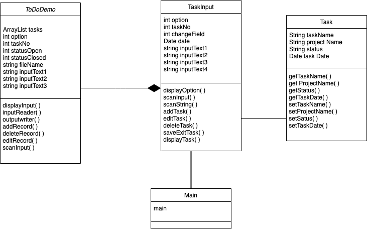

# ToDo List

## Overview 

ToDoList application is to manage task list for different users. The users can create a new tasks and they can go through the Task list and search their task by project name or by the date on which the task has been created.They can edit,remove,save and quit the tasks when ever needed.

## Prerequisites 
IntelliJ IDEA 2019.3.3

Text File

## How To Run

The detailed steps for running the ToDoList application can be referred in UserManual

## Class Diagram 

The Class Diagram of this Project:

## Runing Test

For Running the test we used jUnit.