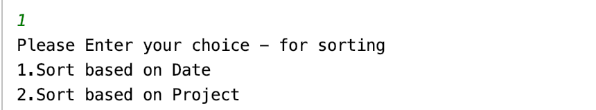
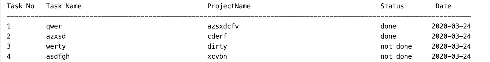
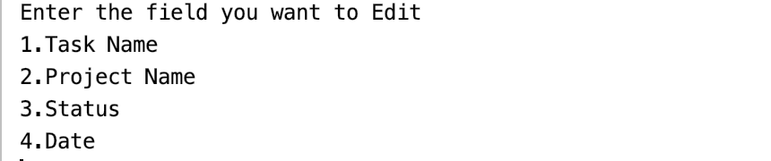

# User Manual
This is the user manual for ToDoList Application

## Main menu
When the user strats the application,the main menu is displayed:

-----------------------------
 To Do List
-----------------------------
(1) Display List

(2)Add New Task

(3) Edit Task

(4) Delete Task

(5) Save & Exit

------------------------------
Enter Correct Option

If the user presses:

(1) A Display list will be, that allows the user to see the tasks in todo list.

(2) The user can add new tasks in the list.

(3) In this menu the user can edit an existing task.

(4) In this menu the user can delete the task which he wants to remove from the list.

(5)In this menu the given details will be saved and can quit.

## Display List 

If the user pressed (1), the show menu is displayed

If the user presses:

(1) A List of tasks sorted by date are displayed.

(2) A List of tasks sorted by projects are dsiplayed.

After displaying the list of tasks and once the user presses enter, the application returns to the main menu.

## Add New Task

If the user pressed (2), to add new task to do list, the following sequence of actions is diplayed step by step:

-  now the  application request user to insert a Task Name

- now the application request user to inser Project Name

-  now the application requests user to insert Status

-  now the application requests user to insert Task Date

- Finally enter the option will be displayed for saving or for any further tasks or for quiting the task

Once the 5 fields are inserted, a new task was created and addedd to ToDo List.

NOTE : Date must have the following format(YYYY-MM-DD)and the new task will not be created

## Edit Task 

If the user presses (3) the Edit Task menu is displayed the following sequence of options are displayed step by step:

- Now the application requests user to enter the task no to edit 

- Now the application requests user to enter the field they want to edit

- Now after entering the field to be edited the application requests user to edit the particular field

-  Finally ,now the application requests user to enter an option for save and exit

## Delete Task

If the user presses (4) the delete task menu is displayed and the following sequence of options are displayed step by step:

- Now the application requests user to enter the task no to delete

- After entering the task no the record gets deleted successfully 

- finally now , the application show enter an option for save and exit as above 

## Save & Exit

This step is used in all the other tasks so, after every task we have an option or a step called enter option there user can enter (5) as that is Save & Exit or user can choose any other option for continuation of other tasks or he can call save & exit.

